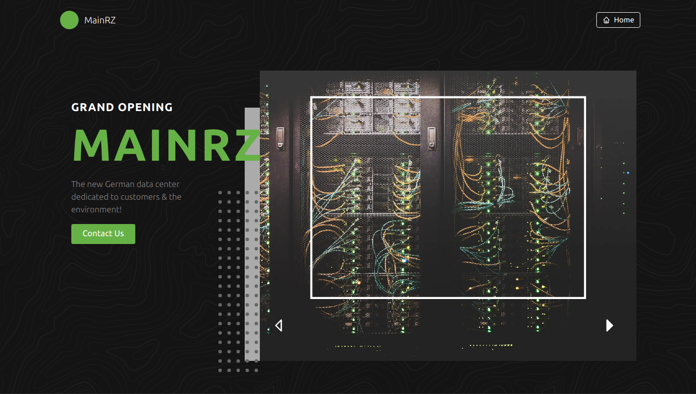

# 🇩🇪 MainRZ Homepage

> https://mainrz.de

Built with [Next.js](https://nextjs.org) and [TailwindCSS](https://tailwindcss.com) 🎉

## 🚀 Getting Started

First, install the dependencies:

```bash
npm install
# or
yarn
```

Then, run the development server:

```bash
npm run dev
# or
yarn dev
```

Then you can open [http://localhost:3000](http://localhost:3000) to visit the page!

## 📺 Screenshot



## 📝 License

MIT
